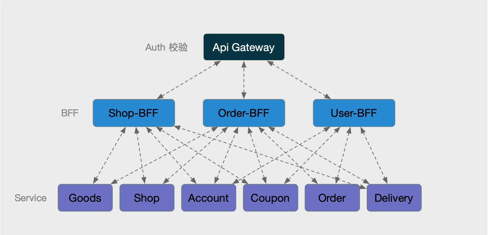
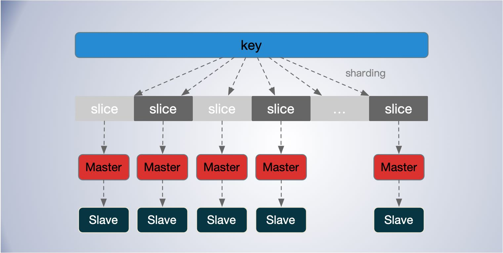
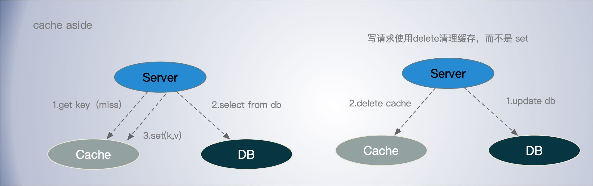

[TOC]

## 要求

毕业项目
对当下自己项目中的业务，进行一个微服务改造，需要考虑如下技术点：
1）微服务架构（BFF、Service、Admin、Job、Task 分模块）
2）API 设计（包括 API 定义、错误码规范、Error 的使用）
3）gRPC 的使用
4）Go 项目工程化（项目结构、DI、代码分层、ORM 框架）
5）并发的使用（errgroup 的并行链路请求
6）微服务中间件的使用（ELK、Opentracing、Prometheus、Kafka）
7）缓存的使用优化（一致性处理、Pipeline 优化

毕业总结
毕业总结写在 README 文件里即可。（可以写一下本学期的心得体会、或者学习方法、自我总结都可以）
要求将毕业项目和毕业总结，提交到 GitHub 上面，毕业项目作业提交地址：https://github.com/Go-000/Go-000/issues/83

截止时间：3 月 20 日（周六）23:59 前。

## 项目简介

一个类似外卖点单配送应用。

主要涉及的子系统有 shop shop-admin、 goods goods-admin、 account、 activity、 delivery、order、bigdata 系统。

## 架构组成

ApiGateway 使用同一套集群，高可用部署，目前用的是 Kong 。

BFF：分成 Shop-BFF，Order-BFF，User-BFF 三个独立的集群部署。

Service：各个服务有自己独立的 db 和 cache。

各个子系统通过 `kafka` 把一些数据打到大数据平台，进行一些计算分析和学习。

通过 `ELK` 做商品和店铺的搜索服务。

监控系统基于 `Prometheus` 。

链路追踪基于 `Opentracing` 。

考虑到公司以 Go 为主，服务发现就用 CP 型的 `Consul`。

## 消息中间件

通过消息中间间，实现一个系统之间解耦，异步化设计，降低阻塞。

- 埋点统一，日志行为数据，通过 kafka 流转到大数据系统。

- 通过 kafka 消息，异步回填缓存，通知刷新缓存。
- 一些活动，如下单发送优惠券活动，通过消息队列来实现。

- 下单支付成功后，通过订单到运力之间消息发布订阅实现呼叫运力。

除了一些埋点统计，日志类的业务，其他业务原则上，不应该有消息丢失

- kafka 消息投递模式，最少一次。
- 如果不能重复消费的，需要业务层支持消息幂等设计，防止投递失败时，重试。

### Kafka 消息不丢失配置

Producer

- Producer 使用至少一次（at least once）；
- 的库如果是异步批量投递消息的，需要能通过回调来判断消息是否成功投递，

Broker 

- 使用副本数大于等于 3个。副本越多自然越安全，但是也意味着开销也越多；
- 确保成功提交到多副本才算成功提交，如果必要的话，可以考虑设置 `acks = all`，即所有的 Broker 都提交成功了才算成功保存；
- 关闭 unclean 领导选举，避免落后 Leader 太多的副本当选为 Leader；

Consumer 

- 不开启自动提交位移，手动提交消费位移，遵循消费成功再提交消费位移的顺序；

## 缓存设计

缓存无处不在，缓存在解决不同媒介之间速差有着重要的作用。

在架构设计中，对于提升服务性能，处理海量请求方面，`缓存和消息队列处于第一梯队`的位置。无论对于读还是写，缓存都能发挥提升性能的作用。

在本项目中，缓存主要使用 Redis ，主要用于存储热点静态的数据。如：

- 商品，列表，详情。

- 店铺的列表，详情。

- 评论信息列表。

### 隔离部署

- 不同的服务之间，缓存服务彼此隔离，避免相互影响。

### 数据分片

使用 Redis Cluster，其分片基于虚拟槽位哈希，这里跟一致性哈希虚拟节点的区别在于，当一个节点下线时，其所负责的分片数据并不会顺时针合并给之后节点，比如 Redis Cluster 如果主节点挂掉了，可以让对应的 Slave 节点顶上去继续服务。

### 缓存一致性问题

**Cache Aside Pattern**

读请求

- 先读缓存
- 缓存命中，直接返回数据
- 缓存未命中，则查询DB
- 将数据set到缓存，用 SETNX 指令，即当 key 不存在时才设置缓存，防止旧的读覆盖新的写数据。

写请求

- 先更新数据库。
- 后淘汰缓存，采用 delete 淘汰，而不是set更新。 这样可以解决并打写导致的数据不一致。

先新更新数据库还是先更新缓存？

- 建议先更新数据库，但是这个不能解决缓存一致性问题

更新缓存 or 删除缓存？

- 建议删除缓存，这样可以解决多个并发写导致的数据不一致问题，但是需要归并回源请求 db。

很多场景数据的一致性要求其实没那么高，适当的牺牲一致性，往往可以换来不小的性能提升。不可否认不一致会有损用户体验，所以这是门取舍的艺术。

对于多级缓存，要强调一致性，可以先更新自己的db和cache，然后通过异步通知的方式通知上层应用更新缓存。

**读写一致性**

主要是要实现写的一致性，读一致性，适当牺牲，比如商品库存信息，展示的时候，可以允许缓存(如果老本允许的话)，不及时刷新的情况，可在下单的时候做库存一致性校验。

### 缓存预热

当一个缓存刚上线时，缓存的命中率将非常低，这回降低应用的吞吐能力，更重要的是，大量的请求会直接落在的 DB 上，这可能导致 DB 过载引起级联故障。

- 通过日常监控统计，统计高频热点 key，通过 job 进行主动预热；
- 从其他节点同步数据
- 通过流量控制，逐步增加新节点承担的请求量。

### 注意问题

**空值保护** 

- 缓存中设置空值保护，将对应的key的value设置特定的标志如 “null”等标志。有点类似 CDN 的404保护。无效的请求没必要每次都回源查找。可以把过期时间设的稍微短一点，定期查找一次数据库，或者数据库更新时刷新缓存。
- 也可以针对空值，在本地维护一个Bloom filter 或者 BitSet, 记录空值。

**缓存击穿**

- 延长缓存过期时间，甚至永不过期。但是依然要考虑当 cache miss 时，如何减小对 db 的冲击。
- *singlefly*：对关键字进行一致性 hash，使其某一个维度的 key 一定命中某个节点，然后在节点内使用互斥锁，保证归并回源。
- *异步队列回填缓存*：如果 cache miss，交由队列聚合一个key，来 load 数据回写缓存，对于 miss 当前请求可以使用 singlefly 保证回源。

**缓存雪崩**导致 db 过载。

- 缓存过期时间随机化处理，避免同一时间过多 key 同时过期。
- 同一个 key 多副本，sharding 到不同的节点，不同的过期时间，起始和上面一条差不多，本质上无非是从时间和空间上分摊请求压力。
- 非常热的 key 可以设置用不过期，甚至改为应用 local cache。

考虑 redis 线程数问题，尽量避免时间复杂度为 O(n) 的操作。

避免大 Value，这回造成吞吐抖动严重，对于超大的 value 也可以考虑拆成多个key，分多次存取。或者对于 大 key 使用 memcached ，分成多个 key，通过 memcached 的 flag 标示。但思路依然是拆分大 key。

使用 Pipeline 来合并请求，但是需要注意集合不能太大。

## 监控

监控系统基于 Opentracing + prometheus + graffna + influxDB 实现。

**监控指标**

服务监控

- 启动时间
- 发版时间，
- 服务应用指标：延迟、流量、错误码分布、容量饱和度。

实现代码里 watchdog 在资源高位时自动触发，采样生成 pprof 分析文件。

系统监控：

- CPU：瞬时、平均使用率，负载、上下文切换、中断次数，IO等待时间、CPU缓存命中率；
- Memory：使用率，可用内存，Buff、Cache、slab 信息、Swap 信息；
- 磁盘：使用率、饱和度、IOPS、响应时间、磁盘空间使用率。
- 网络：带宽、吞吐量、延时，TCP/IP状态等，
- 其他：进程信息、FD
- Runtime：各类 GC、Mem 内部状态，调度器运行情况等.

其他：缓存、DB、消息中间件等监控

## 其他

### 幂等设计

在面对系统失败和超时，意外重复，就需要率幂等问题了。尤其是在超时的情况下，并不知道到底是成功了还是失败了，所以幂等设计在服务和接口设计中非常重要。

常见的实现方法有 唯一Token、索引等。它的本质是通过唯一标识，标记同一操作的方式，来消除多次执行的副作用。

当然有些操作天然就有幂等性，比如一些 Get，Delete 操作，执行一次和多次没有区别。

备选方案：

- 方案一：UUID 这样冲突非常小的算法。但 UUID 的问题是，它的字符串占用的空间比较大，索引的效率非常低，生成的 ID 太过于随机，可读性太差，而且没有递增，如果要按前后顺序排序的话，就不太适合了。

- 方案二：雪花算法。它是一个分布式 ID 的生成算法。63位的整型。

- 方案三：数据库唯一约束。
- 方案四：版本号 乐观锁

最终通过雪花算法+数据库唯一约束+乐观锁来实现。

### 分布式锁

很多人说 redis 不适合做分布式锁。尤其是在服务阻塞超时的时候，比如长时间的 full gc 时容易出现 BUG，虽然是小概率事件。

zookeeper 也是个方案，但是 zookeeper 基于 ZAB 协议每次要 两阶段提交，只能支持主写，性能不够好。

方案：使用 zookeeper 来实现。zookeeper 出现瓶颈，可以按业务进行分片，不同的业务对应不同的 zookeeper 集群。

### 分布式事务

是否允许超卖，是否实现商品扣减强一致性、下单时及时扣减优惠券。

方案一：常用的方案是本地事务+事务消息的方式。

方案二：基于 XA 协议，强一致性，有 TM 管理，对上层透明，但是要长时间锁住时间，开销较大。

方案三：TCC，目前 Go 中貌似没有比较好用，成熟的 tcc 框架。

决定使用，tcc，由业务系统提供 try、confirm、cancel 接口方法。事务期间，锁住对应配额的资源。

