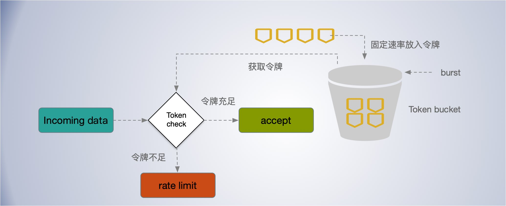
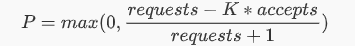
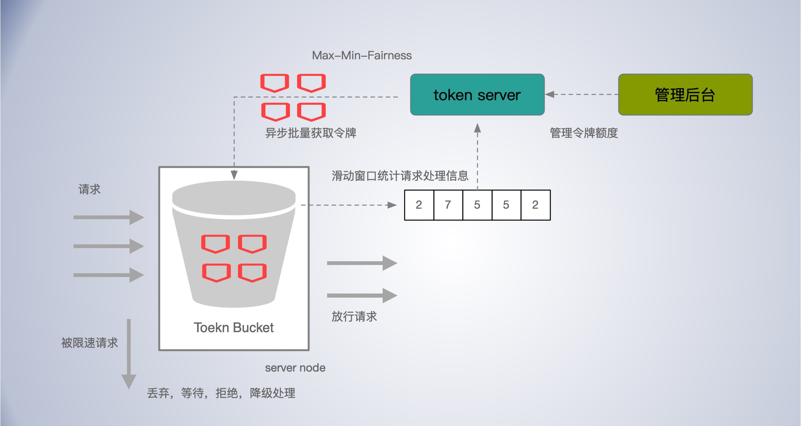

# 可用性设计

[TOC]

## 隔离

在架构设计中，隔离是相对容易实现，且效果显著的措施。我们优先考虑。

BFF 按店铺，订单，会员三个部分进行隔离部署。

每个服务都有自己的独立的 cache 和 db。

资源隔离，CDN 加速，将静态资源和动态API 接口分离。

db 存储设计的动静（冷热）隔离。店铺，商品，会员等的热点字段和非热点字段，分离存储。

物理隔离，为了可用性考虑，分别在华北，华东，华南，多地部署。

## 限流

用来防止系统过载，避免资源耗尽，来提高服务的可用性。限流是对服务是有损的，如果经常触发限流，可能我们的系统容量规划出了问题，需要及时调整。

- 限流要策略可配置。

- 开关可配置。

- 结合自适应限流。

- 客户端限流，服务端限流。
- 分布式限流。


### 限流算法

使用令牌桶，允许一定的突发。



### 限流触发时机

- 使用滑动时间窗口，计算最近 N 个时间窗口 的 CPU 使用情况，计算 CPU 的*滑动均值*，阈值可配置，达到阈值触发限流。


### 客户端自适应限流

客户端根据请求响应分布情况。来自适应决定是否开启熔断。

同样可以使用Google SRE 中提到的客户端自适应限流策略。即在正常情况下，requests == accepts 表示发送的请求等于被处理的请求，当服务端负载开始拒绝请求时会出现 requests > accepts 。设置一个阈值 K

```
requests = K * accepts
```

当发送的请求等于接受到的 K 倍时，开始以一定的概率拒绝客户端的请求，截止返回失败，而不用把请求发出去。



在分母加 1，可以避免在请求很少时全部失败时的特殊情况，避免小样本时请求全部被拒绝。

根据公式，当  requests = K * accepts 时，恰好拒绝概率 P 是 0， 随着 accetps 相对 requests 减小，P 会越来越大。即请求失败的越多，后面被拒绝发送的概率越大，随着请求响应的恢复，P 会逐渐减下，直到客户端关闭限流。

K 值影响截流的效果，

- 降低 K 会使自适应节流算法更加激进；
- 增加 K 值会使该算法变得不再那么激进；


### 分布式限流

分布式限流实现相对单机要复杂，需要考虑中心热点问题，网络延迟问题，并发竞争，公平分配，动态调整配额等许多问题。如果分配不公平，可能出现个别节点负载过高，拒绝请求，而有的节点却处于饥饿状态。

*中心存储-令牌桶分布式限流*

工作节点异步，批量从中心节点获取令牌，在节点本地使用令牌桶限流。这样可以减少网络延迟，也能减少中心节点 redis 的热点压力。




**动态调整 token 配额**

在给工作节点分配令牌时，如何保证公平，结合*最大最小公平*（max-min fairness）MMF端，按节点需求自适应调整分配额度。


### 限流策略

流量染色，请求分级，过载时优先拒绝低优先级请求，或者丢弃非最近用户发来的请求类似 Codel 算法的思路。拒绝请求需要成本，结合客户端自适应限流。

- 下单的请求优先级较高。

- 评论的优先级，较低，过载时，可以优先拒绝。甚至直接降级，关闭该功能入口。；

    

**流量抛弃策略**

1.一种简单的流量抛弃实现方式是根据CPU使用量、内存使用量及请求队列长度等进行节流；

2.另外的做法包括将标准的先入先出(FIFO)队列模式改成后入先出(LIFO；即先处理最新的请求，因为过早的请求，可能用户已经放弃了，并且刷新重试了；

3.使用可控延迟算法 (Codel)，控制缓冲区膨胀，控制最大延迟；

4.对请求按优先级处理；低优先级的优先抛弃；

根据各系统特点，结合上述 4 中策略。


## 熔断

熔断器可以解决这样的问题：在服务提供者出现故障，短时间内无法恢复时，重试或双发不但不能提高服务调用的成功率，反而会给服务提供者带来更大的压力，从而加剧故障。

如果没有更好的方案就次用开源的方案  `Hystrix` 吧。Hystrix 通过一个时间滑动窗口，计算一段时间内服务调用的失败率。默认情况下，滑动窗口包含 10 个桶，每个桶时间宽度为 1 秒，每个桶内记录了这 1 秒内所有服务调用中成功的、失败的、超时的以及被线程拒绝的次数。当新的 1 秒到来时，滑动窗口就会往前滑动，丢弃掉最旧的 1 个桶，把最新 1 个桶包含进来。任意时刻，Hystrix 都会取滑动窗口内所有服务调用的失败率作为断路器开关状态的判断依据，这 10 个桶内记录的所有失败的、超时的、被线程拒绝的调用次数之和除以总的调用次数就是滑动窗口内所有服务的调用的失败率。


## 降级

降级通常说明容量规划的失误, 或者是出现了意料之外的负载转移。整个降级系统应该简单、易懂, 尤其是在不经常使用的情况下。

服务等级划分

- L0：账号服务，订单服务，支付服务
- L1：商品服务，店铺服务，配送服务 （这些其实也不能没有的）
- L2：评论服务，搜索服务，数据复制，资源统计等

L0 的服务有最高的优先级。当出现降级的必要时，可以优先关闭 L2 的服务。

还可以在降级时，牺牲一部分读一致性，延长缓存时间，来提升系统的性能。


## 重试

重试的请求，要保持幂等，所以，需要做幂等设计。

订单提交相关的，可以根据订单流水号和唯一token，结合订单状态机来实现。

限制重试次数

- 原则上重试次数不超过三次，最大值可配置。

重试需要控制比例

- 每个客户端都跟踪重试与请求的比例。一个请求在这个比例低于10%的时候才会重试。这里的逻辑是,如果仅仅只有一小部分任务处于过载状态, 那么重试数量应该是相对较小的。

避免多层级重试

- 重试不应该逐层传递，在出现失败的一层重试，若无法解决则返回客户端无需重试，避免无效重试和`重试倍数放大`；

使用明确的返回代码，区分可重试和不可重试的错误。如果重试明显无法回复的错误，重试只是徒增系统负担。

重试时间指数退让。

重试时间随机化

- 重试时间需要考虑指数退让。同时还需要加入一些 jitter 即随机波动的值，尽量错开客户端的重试时间点，避免集中到一起。

## 超时控制

`连接超时，写超时，读超时`三个超时一个都不应该漏掉，应该有默认值，可配置，通过 kit 基础库兜底默认超时。

超时时间参考 99th 线。


使用超时传递*:* 进程间传递 *+* 超时传递。

**超时传递**: 超时传递指的是把当前服务的剩余时间 Quota 传递到下游服务中，继承超时策略，从而实现请求级别的全局超时控制。

### 进程内超时控制

服务内进(线)程建超时控制，可能耗时阻塞，函数调用加超时控制，比如在 Go 中很多地方都会通过 context 对象显示地进行超时控制。

一个请求在每个阶段*(*网络请求*)*开始前，就要检查是否还有足够的剩余来处理请求，以及继承他的超时策略，使用 Go 标准库的 `context.WithTimeout` 进行超时控制。

```go
func example() {
    ...
	c := pb.NewEchoClient(conn)
	ctx, cancel := context.WithTimeout(context.Background(), 3*time.Minute)
	defer cancel()
	res, err := c.UnaryEcho(ctx, &pb.EchoRequest{Message: "keepalive demo"})
	...
}
```

### 服务间超时传递

1. A gRPC 请求 B，1s超时。
2. B 使用了300ms 处理请求，再转发请求 C。
3. C 配置了600ms 超时，但是实际只用了500ms。
4. 到其他的下游，发现余量不足，取消传递。

在需要强制执行时，下游的服务可以覆盖上游的超时传递和配额。


gRPC 支持超时传递，级联取消。 在 gRPC 框架中，会依赖 *gRPC Metadata Exchange*，基于 *HTTP2* 的 *Headers* 传递 *grpc-timeout* 字段，自动传递到下游，构建带 *timeout* 的 *context*。

```go
if v := r.Header.Get("grpc-timeout"); v != "" {
    to, err := decodeTimeout(v)
    if err != nil {
        return nil, status.Errorf(codes.Internal, "malformed time-out: %v", err)
    }
    st.timeoutSet = true
    st.timeout = to
}

func (t *http2Client) createHeaderFields(ctx context.Context, callHdr *CallHdr) ([]hpack.HeaderField, error) {
    ...
    if dl, ok := ctx.Deadline(); ok {
		timeout := time.Until(dl)
		headerFields = append(headerFields, hpack.HeaderField{Name: "grpc-timeout", Value: encodeTimeout(timeout)})
	}
    ...
}
```

服务间应避免超时不一致导致资源浪费。例如，一个 终端 APP 请求 Service A ，超时为 5 秒； Service A 又依赖一个 Account 服务，超时设置为 10秒，这就出现了超时不一致，当终端 App 5秒超时后，取消请求，但是 Service A 依然在执行对 Account 服务的请求，这就造成了资源的浪费。

